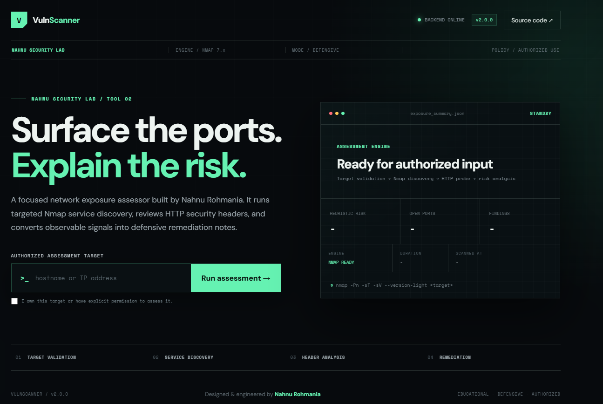
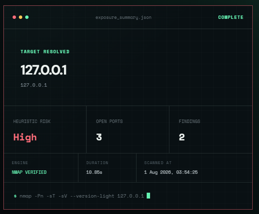
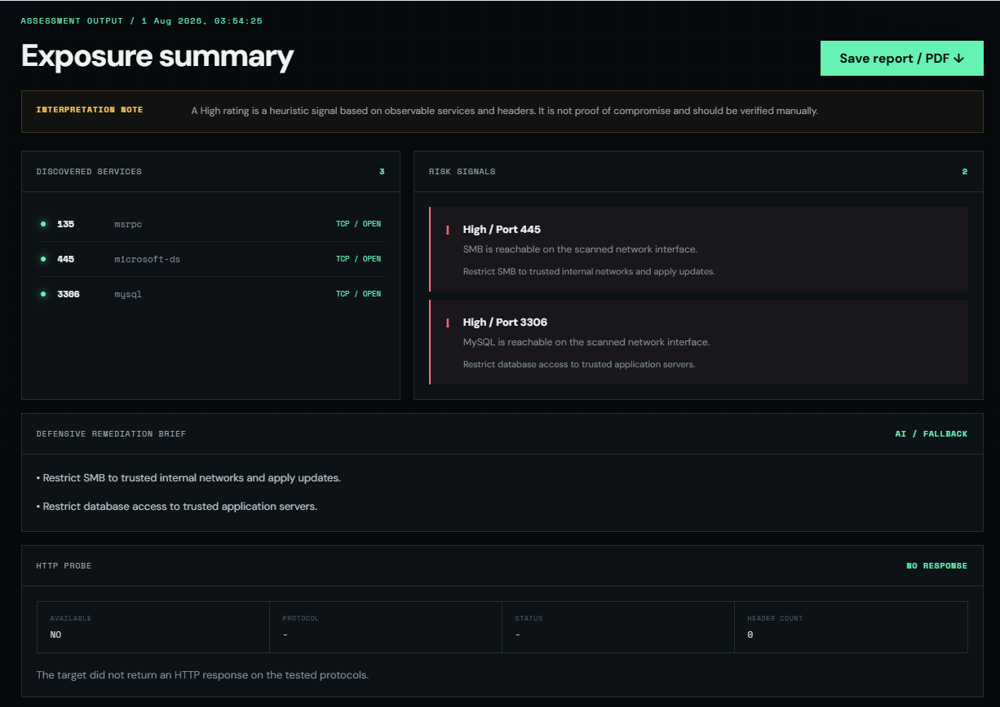

  

A focused network-exposure assessor for authorized defensive security testing.

REACT UI  ->  FLASK API  ->  NMAP + HTTP  ->  RISK ENGINE  ->  GEMINI

<table>
  <tr>
    <td align="center">ENGINE <b>NMAP 7.x</b></td>
    <td align="center">MODE <b>DEFENSIVE</b></td>
    <td align="center">AI LAYER <b>GEMINI + FALLBACK</b></td>
    <td align="center">RISK MODEL <b>HEURISTIC</b></td>
    <td align="center">RELEASE <b>v2.0.0</b></td>
  </tr>
</table>

  <a href="#mission">Mission</a> •
  <a href="#interface">Interface</a> •
  <a href="#pipeline">Pipeline</a> •
  <a href="#nmap">Nmap</a> •
  <a href="#ai">AI Layer</a> •
  <a href="#quick-start">Quick Start</a> •
  <a href="#api">API</a>

[!CAUTION]Authorized use only. Scan only systems you own or have explicit permission to assess. Results are educational indicators, not proof of compromise, and must be verified manually.

01 / MISSION

VulnScanner v2 transforms raw network observations into a focused defensive assessment. It resolves an authorized target, checks a curated list of TCP services with Nmap, reviews HTTP security headers, calculates a transparent heuristic risk score, and produces concise remediation guidance.

The project was designed and engineered by Nahnu Rohmania as a cybersecurity portfolio project combining network discovery, secure API development, frontend product design, and generative AI.

Assessment signal

What VulnScanner reports

Target resolution

Normalized hostname and resolved IPv4 address

Port discovery

Reachable port, protocol, service, state, and version

HTTP review

Protocol, response status, headers, and availability

Risk signals

Severity, issue, affected port, and recommendation

Risk model

Explainable Low, Medium, or High heuristic score

AI guidance

Gemini-generated recommendations or deterministic fallback

02 / INTERFACE PREVIEW

Operator view. The interface prioritizes evidence over decoration: resolved target, open services, HTTP signals, heuristic score, scan duration, timestamp, and the source of remediation guidance.

  

<table>
  <tr>
    <td width="50%" align="center"><b>Assessment Summary</b></td>
    <td width="50%" align="center"><b>Exposure Report</b></td>
  </tr>
  <tr>
    <td></td>
    <td></td>
  </tr>
</table>

03 / ASSESSMENT PIPELINE

flowchart LR
U[Authorized User] --> F[React Dashboard]
F -->|POST /scan| V[Target Validator]
V --> N[Nmap Discovery]
V --> H[HTTPS / HTTP Probe]
N --> R[Risk Engine]
H --> R
R --> G{Gemini available?}
G -->|Yes| AI[Gemini Remediation]
G -->|No| FB[Local Fallback]
AI --> O[Exposure Summary]
FB --> O
O --> F

Stage

Responsibility

Controlled behavior

React Dashboard

Authorization gate, scan input, results, session history, print report

35-second request timeout

Flask API

Request validation, orchestration, CORS, safe errors

4096-byte JSON limit

Target Validator

Normalize target, resolve IPv4, reject unsafe input

Private targets blocked by default

Nmap Engine

Targeted service and version discovery

16 ports and 25-second host timeout

HTTP Probe

HTTPS-first header collection with HTTP fallback

Short timeouts and no crawling

Risk Engine

Map observable signals to explainable findings

Deterministic severity scoring

Gemini Layer

Generate three defensive recommendations

Local fallback when unavailable

04 / NMAP ENGINE

VulnScanner uses a bounded Nmap profile rather than an unrestricted default scan:

nmap -Pn -sT -sV --version-light -T4 --max-retries 1 --host-timeout 25s <target>

Option

Meaning

Purpose

-Pn

Skip ICMP host discovery

Continue when ping is filtered

-sT

TCP connect scan

Works without raw-packet privileges

-sV

Service/version detection

Adds context beyond port numbers

--version-light

Lightweight version probes

Reduces discovery overhead

-T4

Faster timing profile

Suitable for a controlled lab

--max-retries 1

Limit repeated probes

Keeps execution bounded

--host-timeout 25s

Stop long scans

Prevents hanging API requests

Curated TCP ports

21 FTP 22 SSH 23 Telnet 25 SMTP
53 DNS 80 HTTP 110 POP3 135 MSRPC
139 NetBIOS 143 IMAP 443 HTTPS 445 SMB
3306 MySQL 3389 RDP 5432 PostgreSQL 8080 HTTP Proxy

[!NOTE]The selected port set is intended for fast exposure triage. It is not comprehensive coverage and does not replace a full Nmap assessment.

05 / HTTP SECURITY REVIEW

The HTTP module attempts HTTPS first, falls back to HTTP, and collects observable response headers without crawling or exploiting the target.

Content-Security-Policy Strict-Transport-Security (HTTPS only)
X-Frame-Options X-Content-Type-Options
Referrer-Policy

A missing header becomes a transparent finding containing its severity, issue, affected web port, and a defensive recommendation.

06 / HEURISTIC RISK MODEL

Severity

Score

Example signal

Low

1

Missing X-Frame-Options or Referrer-Policy

Medium

2

FTP reachable or missing Content-Security-Policy

High

5

Telnet, SMB, database, or RDP reachable

Total score

Displayed risk

0-2

Low

3-7

Medium

8+

High

[!IMPORTANT]A High result is a heuristic signal based on observable services and headers. It does not prove that the target is compromised or internet-exposed.

07 / GEMINI AI + LOCAL FALLBACK

Gemini receives compact defensive context only:

normalized target hostname;

detected port and service pairs;

heuristic risk classification; and

up to ten findings containing severity and issue text.

The prompt asks for exactly three concise defensive recommendations and explicitly prohibits exploitation instructions.

Analysis source

Dashboard badge

Behavior

Gemini API

GEMINI GENERATED

Returns model-generated defensive guidance

Key missing / provider unavailable

LOCAL FALLBACK

Returns deterministic rule-based recommendations

The API returns analysis_source: "gemini" or analysis_source: "fallback", allowing the frontend to identify the source honestly.

08 / SECURITY CONTROLS

Control

Implementation

Authorization gate

Required confirmation before submitting a scan

Input normalization

Rejects credentials, custom ports, spaces, and malformed targets

Private target protection

Non-global targets blocked unless explicitly enabled for an owned lab

DNS rebinding reduction

Nmap receives the validated resolved IP

Bounded scanning

Curated ports, retries, host timeout, and frontend timeout

Secret management

Gemini API key loaded from environment variables

Restricted CORS

Allowed origins configured through CORS_ORIGINS

Safe client errors

Internal exceptions remain in backend logs

Generated-file hygiene

Reports, caches, environments, and dependencies ignored by Git

09 / TECH STACK

Interface

API and analysis

Engineering

10 / PROJECT STRUCTURE

vulnscanner/
|-- backend/
| |-- modules/
| | |-- http_scanner.py
| | |-- port_scanner.py
| | |-- target_validator.py
| | `-- vuln_checker.py
|   |-- utils/
|   |-- app.py
|   |-- scanner.py
|   `-- requirements.txt
|-- frontend/
| |-- src/
| | |-- App.jsx
| | |-- App.css
| | |-- index.css
| | `-- main.jsx
|   |-- .env.example
|   |-- index.html
|   |-- package.json
|   `-- vite.config.js
|-- docs/
| `-- screenshots/
|-- .env.example
|-- .gitignore
`-- README.md

11 / QUICK START

Prerequisites

Python 3.11 or newer

Node.js and npm

Nmap installed and available in PATH

Gemini API key (optional)

1. Clone the repository

git clone https://github.com/bioonahnuu-design/vulnscanner.git
cd vulnscanner

2. Start the backend

py -m venv .venv
Set-ExecutionPolicy -Scope Process -ExecutionPolicy Bypass
.\.venv\Scripts\Activate.ps1

pip install -r .\backend\requirements.txt

$env:GEMINI_API_KEY="your_api_key"
$env:GEMINI_MODEL="gemini-2.5-flash"
$env:CORS_ORIGINS="http://localhost:5173,http://127.0.0.1:5173"
$env:ALLOW_PRIVATE_TARGETS="true" # owned local lab only
$env:FLASK_DEBUG="false"

python .\backend\app.py

Backend health check:

Invoke-RestMethod http://127.0.0.1:5000/health

3. Start the frontend

Open a second terminal:

cd frontend
Copy-Item .env.example .env
npm install
npm run dev

Open http://localhost:5173.

12 / API CONTRACT

Health check

GET /health

Authorized assessment

POST /scan
Content-Type: application/json

{
"target": "127.0.0.1"
}

<b>Example response shape</b>

{
"target": "127.0.0.1",
"ip": "127.0.0.1",
"risk": "High",
"risk_score": 10,
"ports": [],
"headers": {},
"http": {},
"vulnerabilities": [],
"severity_count": {
"High": 2,
"Medium": 0,
"Low": 0
},
"ai_analysis": "Defensive recommendations...",
"analysis_source": "gemini"
}

13 / VALIDATION

# Backend syntax

py -m py_compile `  .\backend\app.py`
.\backend\modules\target_validator.py `  .\backend\modules\port_scanner.py`
.\backend\modules\http_scanner.py `
.\backend\modules\vuln_checker.py

# Frontend quality checks

cd frontend
npm run lint
npm run build

Check

Status

Python module compilation

PASS

ESLint

PASS

Vite production build

PASS

Authorized local scan against 127.0.0.1

PASS

14 / LIMITATIONS & ROADMAP

Current limitations

Only 16 selected TCP ports are checked.

Reachability does not prove public exposure or exploitability.

Service banners and HTTP headers may be incomplete or misleading.

Scan history exists only in the current browser session.

Public hosting providers may restrict outbound port scanning.

This project does not perform exploitation or authenticated testing.

Planned improvements

Add persistent scan history with privacy-aware retention.

Add configurable authorized port profiles.

Add rate limiting and production observability.

Add automated backend and frontend tests.

Add signed report metadata and improved accessibility.

Deploy the Nmap-capable backend to a suitable controlled environment.

15 / DEPLOYMENT STATUS

Component

Status

Notes

React frontend

Online

Hosted on Vercel

Flask API

Local / redeploy required

Requires Nmap-capable runtime and environment secrets

Gemini

Optional

Enabled only when a valid API key is configured

[!NOTE]The public frontend may remain accessible while scan functionality is unavailable if the separate Flask backend is offline.

NAHNU SECURITY LAB

Designed and engineered by Nahnu RohmaniaInformatics Engineering student at Universitas 17 Agustus 1945 Surabaya

EDUCATIONAL   DEFENSIVE   AUTHORIZED

